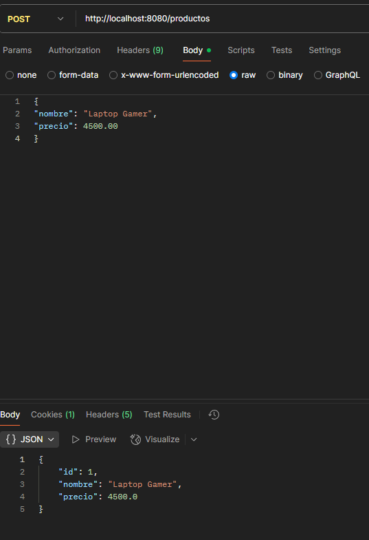
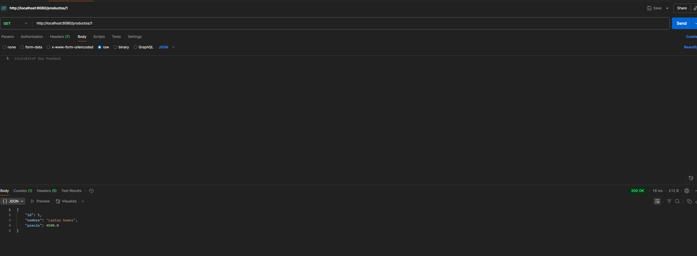

# API REST Productos - Spring Boot

API para gestionar productos con Spring Boot.

## Ejecutar

mvn pacakge

mvn spring-boot:run

## Endpoints

### POST /productos
Crear producto:

{

    "nombre": "Laptop",

    "precio": 1500.0
}

### GET /productos
Obtener todos los productos.

### GET /productos/{id}
Obtener producto por ID.

